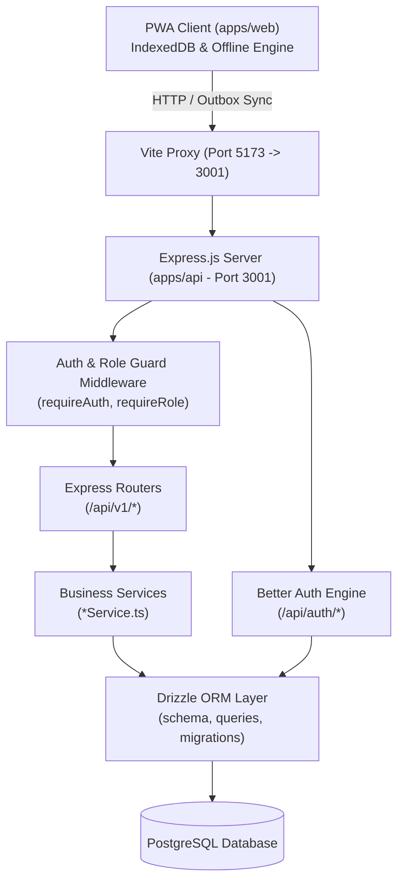

# Implementation Plan — Backend API & Database Schema for Parking Bay KLB

This plan establishes the architecture and design for the **Parking Bay KLB** backend API and database schema. It implements **Express.js**, **Drizzle ORM**, and **Better Auth**, organizing the application into a robust **Service Layer** separated from **HTTP Routes**, and integrating with the existing monorepo structure.

---

## User Review Required

> [!IMPORTANT]
> **Database Engine Selected: SQLite**:
> As requested, we are implementing the backend with **SQLite** using Drizzle ORM (`drizzle-orm/better-sqlite3` or `@libsql/client`).
> The database will be a local file (`data/parking_bay.db`), requiring zero external configuration or installation.
> It can be easily backed up, inspected, or migrated to PostgreSQL in the future if required.

> [!NOTE]
> **Monorepo Structure**:
> - The new backend service will be placed in `apps/api` within the existing npm workspace (`apps/*`, `packages/*`).
> - It will reference `@parking-bay/shared` to reuse constants (locations, checkpoints, users, defect categories, vehicle guide).

---

## Proposed Architecture

### Layer Separation
1. **Routes Layer (`apps/api/src/routes/`)**:
   - Manages Express request/response lifecycles.
   - Enforces Zod schema validations for request parameters and bodies.
   - Applies `requireAuth` and `requireRole` middleware.
   - Translates domain service responses into uniform HTTP status codes (200, 201, 400, 401, 403, 404, 500).
2. **Services Layer (`apps/api/src/services/`)**:
   - Encapsulates pure business logic with zero direct dependency on Express `req`/`res`.
   - Executes Drizzle ORM transactions and queries.
   - Handles geofence distance calculation (120m tolerance check), vehicle occupancy calculations, patrol completion tracking (7 checkpoints per TIP), cleaning checklist completeness (minimum 3 items), and shift inventory auditing.
3. **Database Schema & ORM (`apps/api/src/db/`)**:
   - Type-safe Drizzle schema tables, relations, and indexes.
   - Migration management via `drizzle-kit`.
4. **Authentication (`apps/api/src/lib/auth.ts`)**:
   - **Better Auth** server instance using Drizzle adapter.
   - Staff PIN authentication plugin / custom credentials provider.
   - Session validation and role-based permissions (`satpam`, `cleaning`, `supervisor`, `admin`).

---

## Database Schema Design (Drizzle ORM)

### 1. Authentication Tables (Better Auth + Custom Operational Fields)
- **`users`**:
  - `id`: `text` (Primary Key, e.g. "SEC-01", "CLN-01", "SPV-01" or CUID)
  - `name`: `text` (Staff name, e.g. "Siwit Rio Nandaka")
  - `email`: `text` (Unique email, e.g. `sec01@klb.local`)
  - `emailVerified`: `boolean` (Default: `true`)
  - `image`: `text` (Avatar emoji or photo URL)
  - `role`: `text` ("satpam" | "cleaning" | "supervisor" | "admin")
  - `roleLabel`: `text` ("Komandan Regu (Keamanan)", "Petugas Kebersihan", etc.)
  - `pin`: `text` (4-digit operational PIN, e.g. "1234", "9999")
  - `assignedLocation`: `text` ("TIP A", "TIP B", "TIP A & B")
  - `shift`: `text` ("Shift 1 (07:00 - 19:00)", etc.)
  - `createdAt`: `timestamp`
  - `updatedAt`: `timestamp`
- **`sessions`**: Managed by Better Auth (`id`, `userId`, `token`, `expiresAt`, `ipAddress`, `userAgent`, `createdAt`, `updatedAt`).
- **`accounts`**: Managed by Better Auth (`id`, `userId`, `accountId`, `providerId`, `password`, `createdAt`, `updatedAt`).
- **`verifications`**: Managed by Better Auth (`id`, `identifier`, `value`, `expiresAt`, `createdAt`, `updatedAt`).

### 2. Operational Master Data
- **`locations`**:
  - `id`: `text` Primary Key ("TIP_A", "TIP_B")
  - `name`: `text` ("Rest Area TIP A (Jalur A)")
  - `direction`: `text` ("Arah Surabaya / Timur KM 13+200 A")
  - `lat`: `doublePrecision` (-7.29859966)
  - `lng`: `doublePrecision` (112.54352495)
  - `radius`: `integer` (Default: 120 meters)
  - `maxCapacity`: `integer` (Default: 60 vehicles)
  - `isActive`: `boolean` (Default: `true`)
- **`checkpoints`**:
  - `id`: `text` Primary Key ("CP-A1" to "CP-A7", "CP-B1" to "CP-B7")
  - `locationId`: `text` (Foreign Key -> `locations.id`)
  - `name`: `text` ("Pos Jaga & Gerbang Masuk", "Mushola", "Toilet", etc.)
  - `qrCode`: `text` (Unique scan code, e.g. "KLB-TIP-A-GATE")
  - `icon`: `text` ("🚪", "🚗", "🚻", "🕌", "🚛", "🏛️", "🛣️")
  - `orderIndex`: `integer` (1 through 7)
  - `isActive`: `boolean` (Default: `true`)

### 3. Operational Transactions
- **`attendances`**:
  - `id`: `serial` / `uuid` Primary Key
  - `userId`: `text` (Foreign Key -> `users.id`)
  - `locationId`: `text` (Foreign Key -> `locations.id`)
  - `type`: `text` ("masuk" | "keluar")
  - `lat`: `doublePrecision`
  - `lng`: `doublePrecision`
  - `distance`: `doublePrecision` (Meters from geofence center)
  - `accuracy`: `real`
  - `isSimulated`: `boolean` (Default: `false`)
  - `photo`: `text` (Watermarked selfie photo data URL or stored URL)
  - `timestamp`: `timestamp`
  - `syncId`: `text` (Client offline record ID for idempotency deduplication)
  - `createdAt`: `timestamp`
- **`patrol_records`**:
  - `id`: `serial` / `uuid` Primary Key
  - `userId`: `text` (Foreign Key -> `users.id`)
  - `locationId`: `text` (Foreign Key -> `locations.id`)
  - `checkpointId`: `text` (Foreign Key -> `checkpoints.id`)
  - `notes`: `text` ("Kondisi Aman & Terkendali" or findings)
  - `hasIncident`: `boolean` (Default: `false`)
  - `photo`: `text` (Nullable)
  - `timestamp`: `timestamp`
  - `syncId`: `text`
  - `createdAt`: `timestamp`
- **`occupancy_records`**:
  - `id`: `serial` / `uuid` Primary Key
  - `userId`: `text` (Foreign Key -> `users.id`)
  - `locationId`: `text` (Foreign Key -> `locations.id`)
  - `zone`: `text` ("depan" | "belakang")
  - `gol1`: `integer` (Mobil Pribadi / Minibus / Bus)
  - `gol2`: `integer` (Truk Besar 2 Sumbu / CDD)
  - `gol3`: `integer` (Truk Besar 3 Sumbu / Tronton)
  - `gol4`: `integer` (Truk Besar 4 Sumbu / Trailer)
  - `gol5`: `integer` (Truk Trailer 5+ Sumbu)
  - `totalVehicles`: `integer` (Computed sum: gol1..gol5)
  - `capacityPercent`: `real` (Calculated percentage of 60 max slots)
  - `timestamp`: `timestamp`
  - `syncId`: `text`
  - `createdAt`: `timestamp`
- **`defect_reports`**:
  - `id`: `serial` / `uuid` Primary Key
  - `userId`: `text` (Foreign Key -> `users.id`)
  - `locationId`: `text` (Foreign Key -> `locations.id`)
  - `category`: `text` ("Pilar Baja Berkarat", "Paving Ambles", "Atap Kanopi Bocor", "Pagar Pembatas Rusak", "Penerangan / PJU Mati", "Sanitasi / Kran Rusak")
  - `pillarNumber`: `text` (Nullable, "P-01" to "P-24")
  - `severity`: `text` ("Ringan" | "Sedang" | "Berat")
  - `notes`: `text`
  - `photo`: `text`
  - `status`: `text` ("open" | "in_progress" | "resolved", Default: "open")
  - `resolvedAt`: `timestamp` (Nullable)
  - `resolvedBy`: `text` (Nullable)
  - `timestamp`: `timestamp`
  - `syncId`: `text`
  - `createdAt`: `timestamp`
- **`cleaning_records`**:
  - `id`: `serial` / `uuid` Primary Key
  - `userId`: `text` (Foreign Key -> `users.id`)
  - `locationId`: `text` (Foreign Key -> `locations.id`)
  - `area`: `text` ("Toilet Pria", "Toilet Wanita", "Mushola", "Selasar UMKM")
  - `checkedItems`: `jsonb` / `text` (Array of checked tasks: `["floor", "trash", "soap", ...]`)
  - `photoBefore`: `text`
  - `photoAfter`: `text`
  - `notes`: `text`
  - `timestamp`: `timestamp`
  - `syncId`: `text`
  - `createdAt`: `timestamp`
- **`shift_handovers`**:
  - `id`: `serial` / `uuid` Primary Key
  - `userId`: `text` (Foreign Key -> `users.id`, Officer handing over)
  - `recipientName`: `text` (Officer receiving shift)
  - `shift`: `text` ("Shift 1 ke Shift 2", etc.)
  - `locationId`: `text` (Foreign Key -> `locations.id`)
  - `inventory`: `jsonb` / `text` (State of security tools: HT, Senter, Tongkat, APAR, Kunci, etc.)
  - `notes`: `text`
  - `timestamp`: `timestamp`
  - `syncId`: `text`
  - `createdAt`: `timestamp`
- **`sos_alerts`**:
  - `id`: `serial` / `uuid` Primary Key
  - `userId`: `text` (Foreign Key -> `users.id`)
  - `locationId`: `text` (Foreign Key -> `locations.id`)
  - `type`: `text` ("Kecelakaan Kendaraan", "Kebakaran", "Kriminalitas", "Medis Darurat", "Kendaraan Mogok")
  - `lat`: `doublePrecision`
  - `lng`: `doublePrecision`
  - `status`: `text` ("active" | "acknowledged" | "resolved", Default: "active")
  - `resolvedAt`: `timestamp` (Nullable)
  - `resolvedBy`: `text` (Nullable)
  - `notes`: `text` (Nullable)
  - `timestamp`: `timestamp`
  - `createdAt`: `timestamp`
- **`notifications`**:
  - `id`: `serial` / `uuid` Primary Key
  - `title`: `text`
  - `desc`: `text`
  - `tag`: `text` ("Cuaca Lapangan", "Instruksi SOP", "Sanitasi", "Sistem PWA")
  - `icon`: `text`
  - `locationId`: `text` (Nullable, broadcast to all if null)
  - `authorId`: `text` (Nullable, Foreign Key -> `users.id`)
  - `createdAt`: `timestamp`

---

## Route & Service Separation Details

Each feature area is split into a **Route** (HTTP/Express controller) and a **Service** (Domain logic + Drizzle queries):

### 1. Authentication
- **Route**: `apps/api/src/routes/auth.route.ts`
  - `POST /api/v1/auth/pin-login`: Staff quick login via Staff ID + 4-digit PIN.
  - `GET /api/v1/auth/me`: Fetches the authenticated user profile and active shift.
  - `POST /api/v1/auth/logout`: Revokes active session.
  - Mounts Better Auth engine at `/api/auth/*`.
- **Service**: `apps/api/src/services/auth.service.ts`
  - Verifies user PIN, creates Better Auth session token, returns cookie/header auth payload.

### 2. Attendance & Geofencing
- **Route**: `apps/api/src/routes/attendance.route.ts`
  - `POST /api/v1/attendance`: Check-in / Check-out with selfie photo and GPS coords.
  - `GET /api/v1/attendance/today`: Retrieves today's attendance record for current user.
  - `GET /api/v1/attendance/history`: List attendances by date and location (Supervisor only).
- **Service**: `apps/api/src/services/attendance.service.ts`
  - Calculates Haversine distance from Rest Area geofence center (`TIP_A` or `TIP_B`).
  - Rejects submissions outside the 120m radius tolerance unless emergency override is flagged.
  - Inserts attendance record and handles photo storage.

### 3. Patrol & Checkpoints
- **Route**: `apps/api/src/routes/patrol.route.ts`
  - `POST /api/v1/patrols`: Record checkpoint QR scan.
  - `GET /api/v1/patrols/today`: Returns completed checkpoints for the active shift and location.
  - `GET /api/v1/patrols/status`: Calculates patrol round completeness (e.g. 7/7 checkpoints completed).
- **Service**: `apps/api/src/services/patrol.service.ts`
  - Validates QR code against registered checkpoints in the target location.
  - Tracks round completion status and alerts if an incident is logged.

### 4. Vehicle Occupancy
- **Route**: `apps/api/src/routes/occupancy.route.ts`
  - `POST /api/v1/occupancy`: Log vehicle counts for Gol 1 through 5 in a zone (`depan` or `belakang`).
  - `GET /api/v1/occupancy/latest`: Fetches the latest occupancy snapshot for TIP A and TIP B.
  - `GET /api/v1/occupancy/history`: Hourly time-series data for analytics charts.
- **Service**: `apps/api/src/services/occupancy.service.ts`
  - Computes `totalVehicles = gol1 + gol2 + gol3 + gol4 + gol5`.
  - Computes `capacityPercent = (totalVehicles / MAX_CAPACITY) * 100`.
  - Determines risk status (Normal < 70%, Warning 70-90%, Overcrowded >= 90%).

### 5. Facility Defect Reporting
- **Route**: `apps/api/src/routes/defect.route.ts`
  - `POST /api/v1/defects`: Report damaged infrastructure (steel pillars, paving, canopy, sanitation).
  - `GET /api/v1/defects`: Query defects filtered by location, severity, status, and pillar number.
  - `PATCH /api/v1/defects/:id/status`: Update status (`open` -> `in_progress` -> `resolved`).
- **Service**: `apps/api/src/services/defect.service.ts`
  - Validates pillar numbers (`P-01` through `P-24`) when category is steel pillar.
  - Prioritizes "Berat" defects for immediate notification broadcast.

### 6. Cleaning & Sanitation
- **Route**: `apps/api/src/routes/cleaning.route.ts`
  - `POST /api/v1/cleanings`: Submit sanitation checklist with before/after photos.
  - `GET /api/v1/cleanings/today`: Get sanitation audits for today.
- **Service**: `apps/api/src/services/cleaning.service.ts`
  - Enforces minimum 3 checked items per cleaning task.
  - Saves audit photos and notes.

### 7. Shift Handover (Buku Mutasi)
- **Route**: `apps/api/src/routes/handover.route.ts`
  - `POST /api/v1/handovers`: Submit shift transition log and security inventory check.
  - `GET /api/v1/handovers/latest`: Retrieve latest handover entry.
- **Service**: `apps/api/src/services/handover.service.ts`
  - Validates inventory state for all mandatory security tools (HT, baton, APAR, flashlight).

### 8. SOS Emergency Dispatch
- **Route**: `apps/api/src/routes/sos.route.ts`
  - `POST /api/v1/sos`: Broadcast panic alert with real-time GPS coordinates.
  - `GET /api/v1/sos/active`: Fetch all active alerts for command center display.
  - `PATCH /api/v1/sos/:id/resolve`: Resolve emergency alert.
- **Service**: `apps/api/src/services/sos.service.ts`
  - Creates active emergency broadcast, logs timestamp, and handles resolution notes.

### 9. Analytics & Reporting
- **Route**: `apps/api/src/routes/analytics.route.ts`
  - `GET /api/v1/analytics/summary`: Aggregated KPIs (traffic, patrol %, defects, cleaning).
  - `GET /api/v1/analytics/export`: Generates downloadable JSON/CSV operational summary.
- **Service**: `apps/api/src/services/analytics.service.ts`
  - Performs cross-table aggregation queries for supervisor review.

### 10. Offline-First Sync API (Batch Outbox Ingestion)
- **Route**: `apps/api/src/routes/sync.route.ts`
  - `POST /api/v1/sync/batch`: Accepts an array of outbox items captured offline by the PWA.
- **Service**: `apps/api/src/services/sync.service.ts`
  - Runs a Drizzle transaction dispatching records to their respective services (`attendances`, `patrols`, `occupancy`, `defects`, `cleanings`, `handovers`, `sos`).
  - Uses `syncId` to ensure idempotent deduplication (preventing duplicate submissions if connection drops midway).
  - Returns `{ success: true, syncedCount: number, failedItems: [] }`.

---

## Planned Implementation Steps

### Step 1: Initialize `apps/api` Project
1. Create `apps/api/package.json` with workspace name `@parking-bay/api`.
2. Configure TypeScript (`tsconfig.json`) and Drizzle config (`drizzle.config.ts`).
3. Install dependencies:
   - `express`, `cors`, `helmet`, `zod`, `dotenv`
   - `drizzle-orm`, `drizzle-kit`, `postgres`
   - `better-auth`
   - `@parking-bay/shared`

### Step 2: Database Schema & Better Auth Setup
1. Create schema definitions in `apps/api/src/db/schema/` (`auth.ts`, `locations.ts`, `operations.ts`, `communications.ts`).
2. Create `apps/api/src/lib/auth.ts` configuring Better Auth with the Drizzle PostgreSQL adapter and custom staff PIN verification.
3. Configure database connection pool in `apps/api/src/db/index.ts`.

### Step 3: Implement Services & Routes
1. Build `AuthService` and `auth.route.ts`.
2. Build `AttendanceService` and `attendance.route.ts`.
3. Build `PatrolService` and `patrol.route.ts`.
4. Build `OccupancyService` and `occupancy.route.ts`.
5. Build `DefectService` and `defect.route.ts`.
6. Build `CleaningService` and `cleaning.route.ts`.
7. Build `HandoverService` and `handover.route.ts`.
8. Build `SosService` and `sos.route.ts`.
9. Build `AnalyticsService` and `analytics.route.ts`.
10. Build `SyncService` and `sync.route.ts` for offline PWA batch sync.
11. Build `LocationService` and `location.route.ts`.

### Step 4: Middleware & Express Application Assembly
1. Setup `requireAuth` and `requireRole` in `apps/api/src/middleware/auth.ts`.
2. Setup Zod schema validation middleware in `apps/api/src/middleware/validate.ts`.
3. Setup error handler in `apps/api/src/middleware/error.ts`.
4. Assemble Express app in `apps/api/src/index.ts`.

### Step 5: Database Seeder Script
1. Create `apps/api/src/db/seeds/seed.ts` populating initial data from `@parking-bay/shared` constants:
   - 5 Staff members (Satpam, Cleaning, Supervisor) with PINs.
   - TIP A and TIP B coordinates and geofences.
   - All 14 patrol QR checkpoints (`CP-A1`..`CP-A7`, `CP-B1`..`CP-B7`).

### Step 6: Frontend PWA Integration & Verification
1. Configure `apps/web/vite.config.ts` to proxy `/api` requests to Express backend (`http://localhost:3001`).
2. Update `apps/web/src/services/sync.ts` to send batched offline outbox records to `POST /api/v1/sync/batch`.
3. Verify end-to-end flow with automated checks and manual endpoint verification.

---

## Verification Plan

### Automated Verification
- Run TypeScript type checks: `npm run build --workspace=packages/shared` and `tsc --noEmit` in `apps/api`.
- Run Drizzle schema validation: `npx drizzle-kit check`.
- Run database seeder: `npm run seed --workspace=apps/api`.

### Manual API & Workflow Testing
- **Auth**: Test `POST /api/v1/auth/pin-login` with PIN "1234" for Siwit Rio Nandaka and verify session cookie/token.
- **Attendance Geofence**: Submit test attendance with TIP A coordinates (should pass) and outside coordinates (should return geofence error).
- **Patrol Checkpoint**: Submit scan `KLB-TIP-A-GATE` and check completed list in `GET /api/v1/patrols/today`.
- **Occupancy Tally**: Submit counts for Gol 1-5 and verify total vehicles and capacity percentage in `GET /api/v1/occupancy/latest`.
- **Defect Reporting**: Submit a defect with pillar `P-04` and check listing in `GET /api/v1/defects`.
- **Offline Batch Sync**: Send a multi-item batch payload to `POST /api/v1/sync/batch` and verify all records persist correctly in the database.
